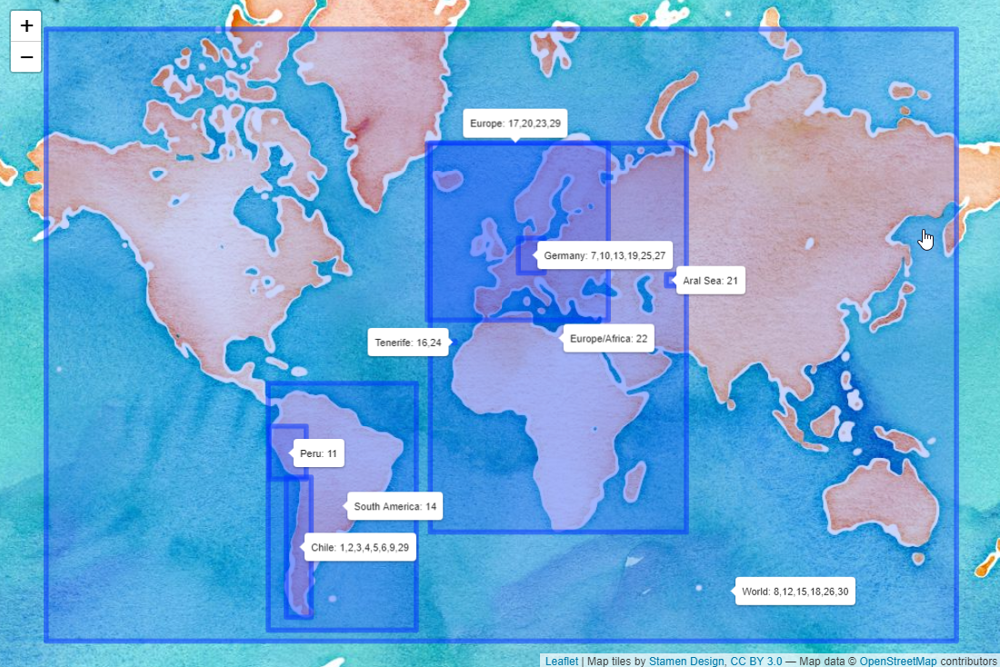

```{r setup, include=FALSE}
knitr::opts_chunk$set(echo = TRUE,warning=FALSE,message=FALSE)
```

During the last 30 days I participated in the 30DayMapChallenge, initiated by Topi Tjukanov. The description and rules of the challenge can be found [here](https://github.com/tjukanovt/30DayMapChallenge).

Every day came along with a topic. This map shows around which places I created my maps (indicating which place was shown on which day). I invite you to look at my codes on Github ([Link](https://github.com/richardvogg/30DayMapChallenge)) in case that any of the topics mentioned in this post are of a particular interest for you.



## My mapping experience

Before 2020 I had no idea of how to create a map. At the beginning of the year there was a GIS workshop for the Green Initiative Group at our company and an expert explained us about raster and vector data, where to find data about Chile and many more interesting things around GIS.

In May, I participated in the awesome tutorial by Stephanie Orellana Bello about Spatial Data in R ([Link to the tutorial in Spanish](https://github.com/sporella/datos_espaciales_tutorial)). This allowed me to do my first steps on my own. I am familiar with R, but had to learn a lot about the spatial part.

I learned a lot during the Challenge and would like to summarize the most interesting things. Overall, my learnings can be split into three large topics:

- Interesting data
- How to plot the world / countries? 
- Interesting techniques (and packages)

## Interesting datasets

For datasets it is important that they can be downloaded easily and are in a format that can either be directly mapped or combined with a prebuild world or country map.

### Earthquakes

Following this [Link](https://earthquake.usgs.gov/earthquakes/search/) you can get information about earthquakes. It is highly customizable (you can select an area of interest on a map and select a timeframe of interest).

I used it to create the map for Day 1 (Points).


### Elevation data 

To download worldwide elevation data, you have two options (probably many more, but these are the two ones I tried).
For the first one, you would need to register at NASA Earthdata and can click on the square of interest on this [website](http://dwtkns.com/srtm30m/) (I used this during day 11 - 3D).
Alternatively, you can also use the `get_elev_raster()` function of the {elevatr} package (compare day 24 - Elevation).


### Chile Shapefiles

The **Biblioteca del Congreso Nacional de Chile** ([Link](https://www.bcn.cl/siit/mapas_vectoriales)) provides some interesting shapefiles around regions and communes in Chile. Moreover, I used the data about water masses (lakes, lagoons etc.) on two submissions.


### Election results Plebiscito Chile 

The results of the chilean elections for a new constitution on October 26th are a very interesting dataset to analyze. Gonzalo Diaz has made the results of each commune available following this [link](https://twitter.com/gdiazc/status/1321637872261353473).


### Forest fires in Chile 

There are many forest fires in the central regions of Chile every year during summer. CONAF makes the numbers of the last years available [here](http://www.conaf.cl/incendios-forestales/incendios-forestales-en-chile/estadisticas-historicas/). This is an excellent example of an untidy dataset. I have a cleaning skript for that dataset [here](https://github.com/richardvogg/GreenInitiatives/blob/master/Conaf_Forestfires.R). After cleaning it is easy to look at trends over time and per region.


### Global precipitation and temperatures 

Worldwide historical data (until today) about temperature, precipitation, radiation and many more interesting measurements can be found at the Physical Sciences Laboratory of the NOAA (National Oceanic and Atmospheric Administration) [here](https://psl.noaa.gov/data/gridded/data.cpc.globalprecip.html).
I used this for two days: Day 13 - Raster where I showed the precipitation of every day in 2019 in Germany and Day 14 - Climate Change where I showed precipitation anomalies in South America.


### Open Trade Statistics

Mauricio Vargas created the excellent {tradestatistics} package ([info](https://github.com/ropensci/tradestatistics)). It contains historical information of trade between countries. I used this on day 15 - Connections, to show how much trash has been exported from the US into different countries.


### Land cover and more

The OECD.Stat website contains a lot of interesting data on country level ([Link](https://stats.oecd.org/Index.aspx?DataSetCode=LAND_COVER)). I used this on day 18 - Land use to see which percentage of which country is used for agricultural purposes.


### Movebank for animal tracking

This interesting project makes available some data about animal movement. Not all datasets are freely available, but a lot of them can be downloaded and analyzed [here](https://www.movebank.org/cms/movebank-main).


### COVID history Germany 

NPGEO Corona registered all COVID cases per German county (Landkreis) since the beginning of the pandemy. You can download the data [here](https://npgeo-corona-npgeo-de.hub.arcgis.com/datasets/dd4580c810204019a7b8eb3e0b329dd6_0?selectedAttribute=Refdatum).
In order to bring this on a map, you might also be interested in the shapefiles of the counties which can be downloaded [here](https://opendata-esri-de.opendata.arcgis.com/datasets/affd8ace4c204981b5d32070f9547eb9_0).


### NASA Worldview 

NASA Worldview is an amazing project which contains worldwide satellite imagery for many many applications. Not all of it can be downloaded, but it is definitely worth taking a look ([Link](https://worldview.earthdata.nasa.gov/)). NASA also has a short tutorial about how to use the website [here](https://www.youtube.com/watch?v=nW8JZJ-5g_0).


## How to plot the world / countries?

### ggplot2 + sf

ggplot2 is one of the best packages R can offer (I use it a lot for data visualization). Now I learned that it is also great to work with maps.

```{r}
library(ggplot2)

ggplot() + 
  borders(regions = c("Germany","France")) +
  coord_quickmap()
```

Instead of plotting directly, you can also get the borders of a country as a dataframe with the `map_data(map="world",region="Chile")` (this can be useful in case you want to transform it). I used this function to plot Chile over Europe for Day 29 - Globe.


### Open Street Map

If you have downloaded any shapefiles (for example from one of the previous examples) you can use the {sf} package to work with them and still plot them with ggplot. The Open Street Map project also provides shapefiles of all types of interesting points, lines and areas.

```{r}
library(osmdata) #Open Street Map
library(sf)

# Unfortunately the bounding box of Valparaiso is not super good, so we adapt it
bbox <- getbb("Valparaíso,Valparaiso Chile")
bbox[1,] <- c(-71.6615, -71.5607)
bbox[2,] <- c(-33.08, -33.017)


streets <- bbox %>%
  opq() %>%
  add_osm_feature(key = "highway") %>%
  osmdata_sf()

ggplot()+
  geom_sf(data = streets$osm_lines,col="grey50",size=0.5)+
  theme_void()
```

### tmap

```{r}
library(tmap)

data("World")

tm_shape(World)+
  tm_polygons(col="life_exp")
```

### leaflet 

There are a lot of different designs available. Just change `providers$OpenStreetMap` for `providers$Stamen.Watercolor` or others to have a different view of the world.

You can add rectangles, labels, markers and more and zoom into the map.

```{r}
library(leaflet)

leaflet() %>%
  addProviderTiles(provider=providers$OpenStreetMap) %>%
  addRectangles(5.99, 47.30, 15.02, 54.98)
```


## Interesting techniques

### inset_element

During the Challenge Thomas Lin Pedersen announced an exciting update of the {patchwork} package. One function called `inset_element` was added which allows to place a plot inside a plot.

It is incredibly easy to use. For the Day 9 - Monochrome submission, I created a small map of South America to show the location of Valparaíso and added it as an inset to the prior map called `valpo`.

```{r, eval=FALSE}
valpo + inset_element(south_america,0.4,0.85,0.5,1,align_to = "full")
```


### geogrid

Joseph Bailey created [this](https://github.com/jbaileyh/geogrid) awesome package which converts a shapefile into a similar gridded shapefile. This can be very helpful if you have some very small and some very large areas and it is hard to see the smaller areas. One has to pay this equal representation with the loss of shapes, so you will lose the fact that people can recognize an area by its shape. I used this to show the results of the Chilean election results (there were only two options, so it can be shown as a percentage). Take a look to see the advantages and disadvantages of each version.


### rayshader

This package, created by Tyler Morgan-Wall, is awesome! It creates 3D plots or 3D elevation maps which look great and are highly customizable. I did my first steps with this package during the challenge.

```{r,eval=FALSE}
#Downloaded from the elevation data source from part 1
peru <- raster("C:/Richard/R and Python/Datasets/Peru Elevation/S09W078.hgt")

#smaller area
bbox <- extent(-77.680,-77.630,-8.910,-8.850)

alpamayo <- crop(peru, bbox)

elmat <- raster_to_matrix(alpamayo)

elmat %>%
  sphere_shade(texture = "desert",sunangle = 270) %>%
  add_shadow(ray_shade(elmat, zscale = 30), 0.5) %>%
  plot_3d(elmat, zscale = 30, fov = 0, theta = 45, zoom = 0.75, phi = 20, windowsize = c(1000, 800),
          baseshape = "circle")
Sys.sleep(0.2)
render_snapshot("Day11_3D/plot.png")
```

This creates one view of the Alpamayo mountain in Peru. It is also easy to create many of those and create a gif.


### gganimate

Now that we are already talking about animated plots, I want to highlight the package {gganimate} (also by Thomas Lin Pedersen) which makes a gif out of a ggplot. 

### Fuzzy matching

When you find an interesting dataset which is not linked to a shapefile, you can not map it directly, but have to join it to a suitable shapefile first. During this join it can happen that the names are not exactly the same (e.g. United States vs. United States of America, or Korea Republic vs. South Korea).
Fuzzy matching can help you to find inexact matches. As this is a longer topic, I actually wrote a whole post about this during day 19 - NULL, which can be found [here](https://mapchallenge-fuzzymatching.netlify.app/).

### Emojis on a map

I guess there are also many ways to add emojis to a map. I used this to show Brewery locations of a private alcohol-free beer testing we did with my family.

A minimal example would look like this, where I added the latitude, longitude and average rating (Durchschnitt) to each brewery.

```{r,eval=FALSE}
ggplot(data=breweries,aes(x=lon,y=lat))+
  borders(regions="Germany",fill="grey30")+
  geom_text(label="\U0001F37A",family="EmojiOne",size=10,aes(col=Durchschnitt))+
  scale_color_gradient(low="red",high="yellow")+
  theme_void()
```

The final code was slightly longer (mainly to change the layout, crop the map etc.), but the idea of using Emojis is to find the Emoji unicode value online and add it as text with `geom_text`, using "EmojiOne" as font family.


### webglobe

I was not aware of how easy it is to work with plots of the globe. The {webglobe} package makes it very easy to highlight countries or points. Check the code of Day 29 - Globe for the whole example, it is not very long, I promise.

```{r,eval=FALSE}
library(webglobe)

webglobe(immediate=FALSE) + 
  wgpolygondf(chile_shift,fill="purple",stroke_width = 2) +
  wgcamcenter(50, 20, 8000)
```


### ggrepel

Among the maps submitted to the #30DayMapChallenge I most enjoyed those that told a story. Annotations are a helpful tool when describing certain points in a map. The {ggrepel} function helps to avoid overlaps between labels. I used this in many maps, for example during Day 17 - Historical where I explained how the midpoint of Europe shifted in the past when countries joined or left.


## Closing words

Participating in the #30DayMapChallenge was a lot of fun, a big thanks to Topi Tjukanov for organizing it and congratulations to all participants. It was great to browse through the contributions on Twitter, learn from you and dream about what type of cool maps I might be able to produce at some point in the future.