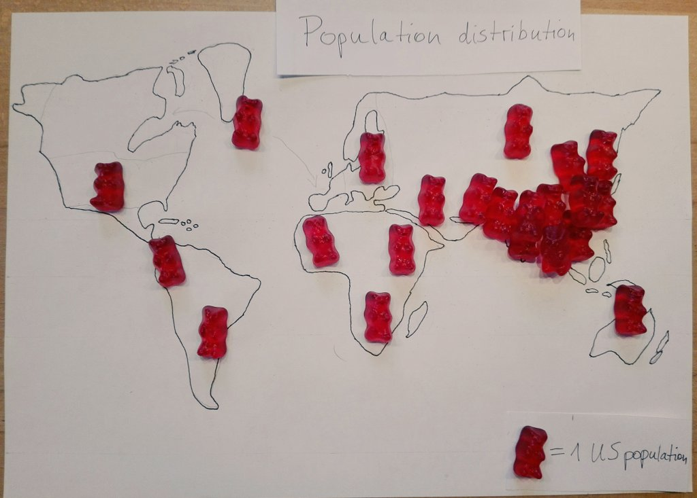
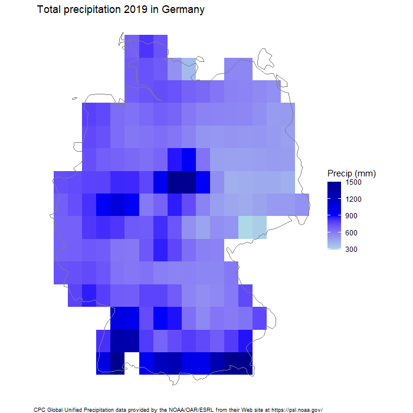

# 30DayMapChallenge

[Here](https://github.com/tjukanovt/30DayMapChallenge) is the link to the official repo. Every day comes along with a topic and the idea is to create a map.
I am using R for most of the plots - with the packages ggplot2, sf, raster and tmap.

## Day 1 - Points

## Day 2 - Lines 

## Day 3 - Polygons

## Day 4 - Hexagons

## Day 5 - Blue

## Day 6 - Red

## Day 7 - Green

## Day 8 - Yellow

## Day 9 - Monochrome

## Day 10 - Grid

## Day 11 - 3D

(also available as gif)

## Day 12 - Map not made with GIS software

## Day 13 - Raster

## Day 14 - Climate Change

## Day 15 - Connections

## Day 16 - Islands

## Day 17 - Historical

## Day 18 - Land use

## Day 19 - NULL

[Link](https://mapchallenge-fuzzymatching.netlify.app/) to my post explaining the details.
